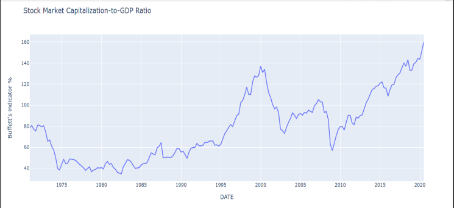

# buffett_indicator
Warren Buffett's indicator - Market Cap to GDP ratio for US stock market

*"The stock market capitalization-to-GDP ratio is a ratio used to determine whether an overall market is undervalued or overvalued compared to a historical average. "* - Investopedia

